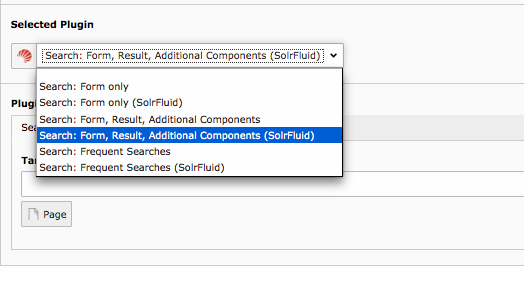

=======
Plugins
=======

Solrfluid provides the following plugin instances that can be configured in the backend:

* Results plugin: **"Search: Form, Result, Additional Components (SolrFluid)"**
* Form plugin: **"Search: Form only (SolrFluid)"**
* Frequent Searches plugin: **"Search: Frequent Searches (SolrFluid)"**

