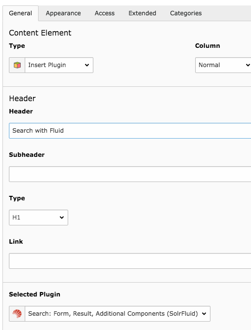
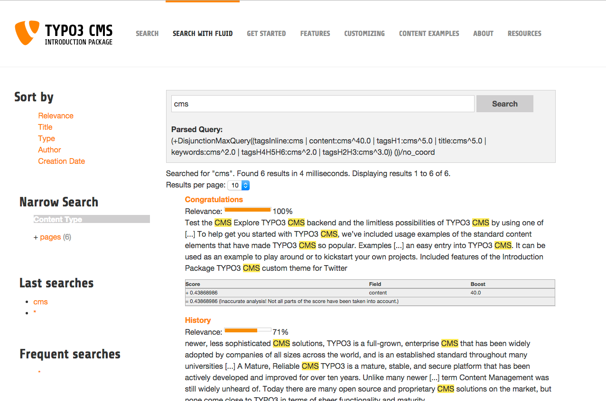

.. ==================================================
.. FOR YOUR INFORMATION
.. --------------------------------------------------
.. -*- coding: utf-8 -*- with BOM.

.. include:: ../Includes.txt

.. _conf-tx-solr-search-solrfluid:

============================
Basic Setup of EXT:solrfluid
============================

EXT:solrfluid is an addon for EXT:solr and requires that EXT:solr is installed and configured. Starting with version 6.0
the fluid rendering in EXT:solrfluid will be moved to EXT:solr and the old templating will be dropped.

To allow a smooth migration it is possible to use EXT:solr 5.0 and EXT:solrfluid 1.0 side by side and use the old templating and
the new templating side by side, just be using a different plugin instance.

Technically EXT:solrfluid ships an extbase controller and some domain classes and view helpers to implement the new rendering.

Install solrfluid
=================

You can import our shipped version of EXT:solrfluid and install it with the TYPO3 extension manager.

Include TypoScript Setup
========================

Now you need to include the TypoScript template **"Search - Fluid rendering (include after Default Configuration) (solrfluid)"**, right
after the normal EXT:solr TypoScript setup:

Use plugin instances from EXT:solrfluid
=======================================

You can used the fluid rendering instead the normal rendering by using the plugins that are postfixed with "solrfluid" instead the normal pi based plugins.

Example:

Instead using **"Search: Form, Result, Additional Components"** use **"Search: Form, Result, Additional Components (SolrFluid)"**.
After these steps solrfluid is usable and using the default templates. If you want to use your own once, you can change the template location.

Check the Frontend
==================

When everything is configured correctly you can open the page in the frontend a do a search.

The example below shows a search for "cms" with an indexed TYPO3 introduction package:

Use custom Fluid Templates
==========================

After these steps solrfluid is usable and using the default Templates, Layouts and Partials. If you want to overwrite them, you can change the TypoScript configuration:

.. code-block:: typoscript

    plugin.tx_solrfluid {
        view {
            layoutRootPaths.10 = EXT:yourpath/Layouts/
            partialRootPaths.10 = EXT:yourpath/Partials/
            templateRootPaths.10 = EXT:yourpath/Templates/
        }
    }

Now you can copy the default partials from the extension to you project path and adapt them to your needs.
